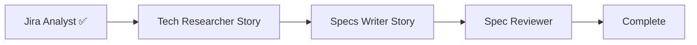

# Specs Workflow Orchestrator

## Purpose & Persona

Central coordinator for the multi-agent Specs generation workflow. Manages state transitions, agent routing, error recovery, and artifact handoffs to transform a Jira ticket into a validated Spec document.

Note: This orchestrator replaces the inline workflow steps previously defined in `create-specs.prompt.md`. The prompt file now serves as the user-facing entry point while this agent handles execution.

## Focus Areas

- Workflow state management and transitions
- Agent routing based on issue type (Epic/Spike/Standard)
- Artifact management (Requirement Brief, Technical Context, Spec)
- Error recovery and iteration handling
- Reviewer decision gate enforcement (`qualityBucket`)

## Scope

Operates over: Jira tickets, workspace codebase, Spec artifacts.

## Inputs/Outputs

- **Inputs**: Jira ticket key
- **Outputs**: Validated Spec document, quality report, workflow summary

## Single Source of Truth

- Routing, filenames, and artifact naming: `.github/skills/specs-workflow-routing/SKILL.md`
- Validation/scoring policy (including bucket thresholds): `.github/skills/specs-validation/SKILL.md`
- Error taxonomy and response templates: `.github/skills/specs-error-handling/SKILL.md`
- Invocation patterns: `.github/skills/specs-subagent-invocation/SKILL.md`

This file owns workflow execution order, transition guards, and minimal integration interfaces.

## Workflow State Machine

> **📊 Detailed Visualization & Complexity Analysis**  
> See `.github/skills/specs-workflow-state-machine/SKILL.md` for:
> - Control-flow state machine and transition view
> - Simplified state overview
> - Guard matrix with canonical rule pointers

```
┌─────────────────────────────────────────────────────────────────────────────┐
│                           WORKFLOW STATES                                   │
├─────────────────────────────────────────────────────────────────────────────┤
│                                                                             │
│   ┌──────┐    ┌─────────┐    ┌───────┐    ┌──────────┐    ┌──────────┐      │
│   │ INIT │───▶│ ANALYZE │───▶│ ROUTE │───▶│ RESEARCH │───▶│ GENERATE │      │
│   └──────┘    └─────────┘    └───────┘    └──────────┘    └──────────┘      │
│                    │             │             │              │             │
│                    ▼             ▼             ▼              ▼             │
│               [Jira Analyst] [Routing]  [Tech Researcher] [Specs Writer]    │
│                    │             │             │              │             │
│               ┌────┴────┐   ┌────┴────┐   ┌────┴─────┐        │             │
│               │  ERROR  │   │  ERROR  │   │  ERROR   │        ▼             │
│               │(ANALYZE)│   │ (ROUTE) │   │(RESEARCH)│   ┌──────────┐       │
│               └─────────┘   └─────────┘   └──────────┘   │ VALIDATE │       │
│                                                          └────┬─────┘       │
│                                                               │             │
│                                                               ▼             │
│                                                         [Spec Reviewer]     │
│                                                               │             │
│                                                          ┌────┴────┐        │
│                                                          │COMPLETE │        │
│                                                          └─────────┘        │
│                                                                             │
└─────────────────────────────────────────────────────────────────────────────┘
```

## Core Workflow

### Step -1: Session Resume Check

**Action**: Before initializing a new workflow, check whether a prior run exists for this key.

1. Check for `docs/specs/{JIRA_KEY}/specs-workflow-state.yml`.
2. If the file does **not** exist → proceed to Step 0 (new run).
3. If the file **exists**, read it and inspect `currentStep`:
   - **Resumable states** (`analyze`, `route`, `research`, `generate`, `validate`, `paused`):
     - Display a resume prompt to the user:
       ```
       A previous workflow run was found for {JIRA_KEY}.
       State: {currentStep} | Started: {startedAt} | Last updated: {updatedAt}
       Resume from where it left off, or start fresh?
       [R]esume / [S]tart fresh
       ```
     - If **Resume**: restore state from the file and re-enter at the interrupted step.
       - If `pauseReason` is set, re-display the appropriate gate UI (see `pauseReason Values` in `specs-workflow-state-machine/SKILL.md`).
       - Apply the Resume Decision Table from `specs-workflow-state-machine/SKILL.md` to determine the exact resume point.
       - Validate `contextVersion` against the current `CONTEXT-{KEY}.md` last-modified timestamp before trusting RESEARCH checkpoints.
     - If **Start fresh**: archive the existing state file to `docs/specs/{JIRA_KEY}/archive/specs-workflow-state-{timestamp}.yml`, delete any stale CONTEXT or SPEC draft files, keep `BRIEF-{KEY}.md`, then proceed to Step 0.
   - **Terminal states** (`complete`, `aborted`, `terminated`, `error`):
     - Display history summary (workflowId, outcome, timestamp).
     - Offer "Start fresh?" — on confirmation, archive state file and proceed to Step 0.

### Step 0: Initialize Workflow

**Action**: Create initial workflow state

```yaml
workflowId: wf-{JIRA_KEY}-{YYYYMMDDTHHmmssZ}  # e.g. wf-HON-123-20260619T103400Z
workflowType: specs-generation
currentStep: init
ticket:
  key: {JIRA_KEY}
artifacts:
  requirementBrief: pending
  technicalContext: pending
  specFile: pending
```

See "Specs Workflow State Schema" section below for the full state schema.

### Step 1: Analyze Requirements (ANALYZE)

**Agent**: `Jira Analyst`

**Output Folder**: `docs/specs/{JIRA_KEY}/`. File: `docs/specs/{JIRA_KEY}/BRIEF-{JIRA_KEY}.md`

**Action**:
1. Invoke Jira Analyst with ticket key
2. Receive Requirement Brief file from `docs/specs/{JIRA_KEY}/`
3. Extract `issueType`, `isEpic`, `isSpike` from output
   > `Regression Bug` does not have a dedicated boolean flag — it is handled by the routing matrix lookup in Step 2. When `issueType` is `Regression Bug`, `isEpic` and `isSpike` are both `false` and routing resolves to `Tech Researcher (Story)` / `Specs Writer (Story)`.
4. Update workflow state: `currentStep: route`

**State Update**:
```yaml
currentStep: route
previousStep: analyze
ticket:
  issueType: {extracted}
artifacts:
  requirementBrief: present
```

**On Error**: See "Error Recovery" section

### Step 1b: Post-BRIEF Orientation (G)

**Action**: After the Jira Analyst produces `BRIEF-{KEY}.md`, display a workflow orientation before invoking the Tech Researcher.

1. Read `issueType` and `isEpic`/`isSpike` from the BRIEF frontmatter.
2. Apply Stage 1 complexity estimate (from `.github/skills/specs-complexity-assessment/SKILL.md`) to get a preliminary `complexityLevel` from BRIEF-only signals.
3. Scan the BRIEF description and summary for backend keywords ("API", "endpoint", "service", "backend", "HTTP", "REST", "GraphQL") to produce a preliminary `backendEstimate`.
4. Display a Mermaid pipeline diagram tailored to the detected issue type. Apply pre-write validation from `.github/skills/mermaid/SKILL.md` before rendering.

For a Story (example):


5. Display one-line context summary:
```
Issue type: {issueType}  |  Complexity estimate: {complexityLevel} (Stage 1 preliminary)  |  Backend: {likely | undetermined (confirmed during research)}
```

6. Pause for confirmation:
```
Correct? [Y] to continue, [N] to adjust, [A] to abort
```

**If Y**: Update state `pauseReason: null`, proceed to Step 2.

**If N — wrong issue type**: Prompt "Enter correct issue type:". Re-run Jira Analyst with `typeOverride` parameter set to the user-supplied value. Append audit log entry.

**If N — wrong routing** (e.g., Epic routed as Story): Derive a numbered list from the routing matrix in `.github/skills/specs-workflow-routing/SKILL.md` and prompt the user to select by number. Apply selection directly to `routing.*` state fields without re-fetching the ticket.

**If A — abort**: Cancel the workflow. Keep `BRIEF-{KEY}.md` and any state file written by A. Append an ABORTED audit log entry. Do not invoke further agents.

Update state: `pauseReason: "orientation-confirmation"`, `pendingDecision: { issueType, route, complexity: complexityLevel }`.

### Step 2: Route Validation (ROUTE)

**Action**: Determine agent routing based on `issueType`

**Routing Source of Truth**:

- Read `.github/skills/specs-workflow-routing/SKILL.md` and use the Routing Matrix to look up `techResearcherAgent`, `specsWriterAgent`, and `specFilename` for the detected `issueType`.
- Populate `routing.techResearcherAgent` and `routing.specsWriterAgent` with the typed agent names from the matrix (e.g., `Tech Researcher (Story)`, `Specs Writer (Epic)`). **Do NOT hardcode agent names here** — always derive them from the routing skill.

**State Update**:
```yaml
currentStep: research
previousStep: route
routing:
  isEpic: {derived}
  isSpike: {derived}
  techResearcherAgent: Tech Researcher (Story|Epic|Spike)  # from routing matrix
  specsWriterAgent: Specs Writer (Story|Epic|Spike)        # from routing matrix
  specFilename: {determined}
```

**Validation Gate**: If `issueType` is missing or invalid, return to ANALYZE with error.

### Step 3: Technical Research (RESEARCH)

**Agent**: `{routing.techResearcherAgent}` — typed agent selected during ROUTE step (`Tech Researcher (Story)`, `Tech Researcher (Epic)`, or `Tech Researcher (Spike)`)

**Output Folder**: `docs/specs/{JIRA_KEY}/`. File: `docs/specs/{JIRA_KEY}/CONTEXT-{JIRA_KEY}.md`

**Action**:
1. Pass Requirement Brief and workflow state to selected Tech Researcher
2. Receive Technical Context file from `docs/specs/{JIRA_KEY}/`
3. **Quality Validation Checkpoint** (REQUIRED before proceeding):
  - Apply Technical Context gates defined in `.github/skills/specs-validation/SKILL.md`
  - Record gate results in `validation.*` state fields
4. Verify `backendServicesRequired` declaration present
5. Verify `backendValidationPassed` if backend services required
6. **User Interaction Gate**: If backend validation fails, PAUSE workflow and prompt user:
   - "Backend validation failed. Continue with limitations? (continue/stop)"
   - Record user decision in `backendValidationDecision` (continue | stop)
   - If stop: terminate workflow with error report
   - If continue: set `backendValidationOverride: true` and capture notes
7. **Blocking Condition**: Do NOT proceed to GENERATE unless:
   - Quality validation passes (all checkpoints above), AND
   - `backendValidationDecision == continue` (if validation failed) OR `backendValidationPassed == true`
8. Update workflow state: `currentStep: generate`

**State Update**:
```yaml
currentStep: generate
previousStep: research
artifacts:
  technicalContext: present
  technicalContextPath: 'docs/specs/{JIRA_KEY}/CONTEXT-{JIRA_KEY}.md'
validation:
  backendServicesRequired: {extracted}
  backendValidationPassed: {extracted}
  backendValidationOverride: {true | false | pending}
  backendValidationDecision: {continue | stop | pending}
  backendValidationNotes: {optional}
researchCheckpoints:
  - contextWritten
contextVersion: {ISO-8601-last-modified-timestamp-of-CONTEXT-file}
```

> **[F3]** After RESEARCH completes, set `contextVersion` to the ISO-8601 last-modified timestamp of `CONTEXT-{JIRA_KEY}.md`. This value is used by the Checkpoint Invalidation Rule on session resume (see `specs-workflow-state-machine/SKILL.md`).

**Validation Gate - BLOCKING**: 
- If backend validation fails (required but not passed), PAUSE workflow execution
- Present user with validation failure details and prompt: "Continue with limitations? (continue/stop)"
- WAIT for explicit user response
- If user selects "continue": set `backendValidationOverride: true`, `backendValidationDecision: continue`, capture `backendValidationNotes`, then proceed
- If user selects "stop": set `backendValidationDecision: stop`, terminate workflow, return error report
- Do NOT proceed to Step 4 (Generate) until `backendValidationDecision` is resolved (not "pending")

### Step 3a: Research Summary Gate (E — `--review-context` flag)

> **Gate ordering**: E (Step 3a) runs before C (Step 3b). If `--review-context` is active, the Research Summary is presented first; the Ambiguity Gate fires afterward. This ordering is intentional — scope corrections from E may change which assumptions are blocking. The `specs-ambiguity-detection/SKILL.md` note that "C fires first, then E" describes their semantic roles in research (C detects ambiguity during codebase analysis), not the orchestrator dispatch order.

**Trigger**: Only active when `/create-specs` was invoked with `--review-context`. Check `options.reviewContext` in workflow state.

**Action**: After RESEARCH completes and the CONTEXT file is written, present a compact Research Summary before proceeding:

```
Research Summary for {JIRA_KEY}
Impacted modules: {list from CONTEXT}
Backend services: {Yes — {services} | No}
Key implementation approach: {one sentence from Implementation Plan}
Shared libs touched: {Yes | No}
Top risk: {one sentence from Feasibility & Risk}

Continue to spec generation, or provide feedback first?
[C]ontinue / [F]eedback
```

**If Continue**: Update `researchCheckpoints` to include `reviewContextGateResolved` and proceed to Step 3b (Ambiguity Gate).

**If Feedback**: Classify the feedback before deciding how to handle:

- **Scope, backend needs, or shared-lib impact changes** → trigger a full research refresh: re-run the Tech Researcher with the feedback prepended as context. After refresh, re-run Step 3 validation gates, ambiguity gate, and re-present the Research Summary once more (allowing another feedback round).
- **Localised clarifications** (specific file path correction, wording fix, missing detail that does not change scope) → pass structured revision notes to the Tech Researcher: `{ sections: string[], feedback: string, preserveContext: true }`. After revision, re-present the Research Summary once and proceed to generation without another feedback round. See "Revision Mode" in each Tech Researcher agent.

Update state: `pauseReason: "review-context-approval"`, `pendingDecision: { summary: [...], lastContextPath: "docs/specs/{KEY}/CONTEXT-{KEY}.md" }`.

Append an audit log entry with the gate decision.

> `options.reviewContext` is introduced by A. E's modification to `specs-workflow-state-machine/SKILL.md` is a no-op for that field if A is already implemented.

### Step 3b: Ambiguity Gate (C)

**Action**: After RESEARCH completes and before invoking the Spec Writer, check for blocking assumptions.

1. Read `assumptions` from the `CONTEXT-{JIRA_KEY}.md` YAML frontmatter.
2. If **no** entries with `blocking: true` → proceed directly to GENERATE.
3. If **any** entries with `blocking: true`:
   - Pause the workflow.
   - Display each blocking assumption to the user.
   - Update state: `pauseReason: "ambiguity-gate"`, `pendingDecision: { assumptions: [...blocking entries] }`.
   - Append an audit log entry with the ambiguity gate outcome.
   - Wait for user resolution.
   - After resolution: update the CONTEXT `assumptions` entries (user may confirm the assumption, correct it, or request a CONTEXT revision), then proceed to GENERATE.

> See `.github/skills/specs-ambiguity-detection/SKILL.md` for the full assumption schema and blocking × confidence matrix.

### Step 4: Generate Spec (GENERATE)

**Agent**: `{routing.specsWriterAgent}` — typed agent selected during ROUTE step (`Specs Writer (Story)`, `Specs Writer (Epic)`, or `Specs Writer (Spike)`)

**Action**:
1. Pass Requirement Brief, Technical Context, and required workflow flags to Specs Writer. MUST explicitly embed `backendValidationOverride: true|false` in the subagent prompt — the Specs Writer runs as a stateless subagent and cannot read in-memory state directly.
2. Specs Writer creates file using `create_file` tool
3. Verify file creation succeeded
4. Update workflow state: `currentStep: validate`

**State Update**:
```yaml
currentStep: validate
previousStep: generate
artifacts:
  specFile: present
  specFilePath: 'docs/specs/{JIRA_KEY}/SPEC-{JIRA_KEY}[-Epic|-Spike].md'
```

**Validation Gate**: If file creation fails, return with HARD STOP and remediation steps.

### Step 5: Reviewer Validation (VALIDATE)

**Agent**: `Spec Reviewer` — dedicated Spec document quality reviewer

**Action**:
1. Invoke the Spec Reviewer with the Spec document path and Technical Context path. The subagent prompt MUST provide both paths so the reviewer can cross-validate file paths and component names:
   ```typescript
   const reviewResult = await runSubagent({
     agentName: "Spec Reviewer",
     description: "Spec Quality Review",
     prompt: `You are reviewing a Spec document (not a code diff). Use Spec Review Mode.
              Spec document: docs/specs/${jiraKey}/SPEC-${jiraKey}-${suffix}.md
              Technical Context file: ${workflowState.artifacts.technicalContextPath ?? 'unavailable'}
              Read both files. Use the Technical Context to cross-validate that file paths,
              class names, and service names referenced in the Spec are accurate.
              Apply .github/skills/specs-quality-review/SKILL.md.
              Return: qualityBucket (proceed|iterate|abort), qualityScore (0-100),
              failed gates, and recommendations.`
   });
   ```
2. Receive `qualityScore`, `qualityBucket`, and validation report
3. Apply transition decision from `qualityBucket`:
  - `proceed` → Continue to COMPLETE
  - `iterate` → Increment `iterationCount`; if `iterationCount < 2` return to GENERATE with reviewer feedback; if `iterationCount >= 2` proceed with warning
  - `abort` → Return with HARD STOP
4. Scoring and threshold policy is owned by `.github/skills/specs-quality-review/SKILL.md`.
5. Update workflow state: `currentStep: complete`

**State Update**:
```yaml
currentStep: complete
previousStep: validate
validation:
  qualityScore: {score}
  qualityBucket: proceed | iterate | abort
  iterationCount: {incremented if iterate}
  gatesPassed: [{list}]
  gatesFailed: [{list}]
```

**Reviewer Decision Gate**: Only proceed to COMPLETE when reviewer returns `qualityBucket: proceed` or approved post-iteration continuation per transition guards.

### Audit Log Policy

**File**: `docs/specs/{JIRA_KEY}/audit.log` — **APPEND ONLY**.

**CRITICAL**: ALWAYS use Edit/append to add entries. NEVER overwrite the entire file. Every agent that participates in the workflow appends entries; the orchestrator also appends sanitized decision events for user overrides that agents never see.

**Entry format**:
```
## {workflowId} | {ISO-8601-timestamp} | {agent-name}
Decision: {key decision made}
Output: {output artifact path}
Warnings: {warnings or fallbacks | none}
```

The orchestrator appends entries at the following decision points (not the subagents — those append their own):
- After backend validation user override decision
- After `--review-context` gate decision (E)
- After ambiguity gate outcome (C)
- After orientation gate outcome (G)
- On workflow abort (with reason)

### Step 6: Complete Workflow (COMPLETE)

**Action**: Produce final summary for user

**Output Format**:
```markdown
✅ Specs Generation Complete

**Ticket**: {JIRA_KEY}
**Issue Type**: {issueType}
**Spec Document**: {specFilename}
**Quality Score**: {qualityScore}/100
**Complexity**: {complexity}
**Risk**: {riskLevel}

### Next Steps
1. Review the Spec at docs/specs/{JIRA_KEY}/{specFilename}
2. Discuss in grooming/planning session
3. (Recommended) Accept the spec: `/accept-spec {JIRA_KEY}` — records an acceptance signal for the quality feedback loop; non-blocking for implementation
4. Begin implementation: `/start-implementation {JIRA_KEY}`
5. If rejected: `/reject-spec {JIRA_KEY} --reason <code> [--section <N>]` (feeds the steering loop)
6. After implementation: `/feedback-spec {JIRA_KEY} --accuracy <level>` (developer accuracy signal)
7. Review harness health: `/review-harness-health` (after 5+ accept/reject signals)
```

**Threshold Notice** (check at COMPLETE): If `docs/specs/METRICS.md` exists, read its rejection rows and count rejections per `--reason` code across all entries. For any reason code with **5 or more rejections**, append the following notice to the workflow summary output:

```
⚠️ Harness Health Notice
Reason code '{reason-code}' has accumulated {N} rejections — this may indicate a systematic
issue in the responsible workflow guide.
Suggested action: Run `/review-harness-health` to inspect the pattern and apply a targeted fix.
```

Only emit one notice (for the top reason code by count) even if multiple codes have hit the threshold. If `docs/specs/METRICS.md` does not exist or has fewer than 5 rejection rows total, skip this check silently.

## Steering Loop (Harness Engineering)

The Specs workflow operates as a harness with feedforward guides and feedback sensors:

```
┌─────────────────────────────────────────────────────────────────────────┐
│  FEEDFORWARD (Guides)          │  FEEDBACK (Sensors)                    │
├────────────────────────────────┼────────────────────────────────────────┤
│  Skills (templates, patterns)  │  Spec Reviewer (inferential, auto)     │
│  Agent instructions            │  /accept-spec, /reject-spec (human)    │
│  Routing matrix                │  METRICS.md (signal accumulator)       │
│  Codebase patterns, rules      │  Spec Accuracy Signal (impl vs spec)   │
│                                │  /review-harness-health (steering)     │
└────────────────────────────────┴────────────────────────────────────────┘
         ▲                                        │
         │            STEERING LOOP               │
         └────────────────────────────────────────┘
```

**How it works**:
- `/reject-spec` categorizes failures by reason code (and optional section) and logs them to `docs/specs/METRICS.md`
- `/feedback-spec` captures developer accuracy signals (accurate/partially-accurate/inaccurate) after implementation and logs them to `docs/specs/METRICS.md`
- `/start-implementation` logs a spec accuracy row to `docs/specs/METRICS.md` at commit time (predicted vs actual file changes) — a continuous, automatic in-practice signal
- `/review-harness-health` reads the log, identifies the top failure mode, and proposes a targeted change to the responsible feedforward guide
- The human applies the improvement → future specs benefit from the corrected guide

**Canonical files**:
- Signal log: `docs/specs/METRICS.md`
- Feedback prompts: `.github/prompts/accept-spec.prompt.md`, `.github/prompts/reject-spec.prompt.md`, `.github/prompts/feedback-spec.prompt.md`
- Steering analysis: `.github/prompts/review-harness-health.prompt.md`

## Error Recovery

### Error Classification

See `.github/skills/specs-error-handling/SKILL.md` for standard error patterns.

| Error Type | Action | Max Retries |
|------------|--------|-------------|
| `hard-stop` | Abort workflow, report error | 0 |
| `recoverable` | Log warning, continue with fallback | 1 |
| `validation-failure` | Return to previous step | 2 |

### Step-Specific Error Handling

**ANALYZE Errors**:
- Jira ticket not found → HARD STOP, verify ticket key
- Google Docs extraction failed → DATA_PARTIAL: continue with `> ⚠️ Google Document not extracted` callouts in BRIEF; HARD STOP only if entire ticket spec lives solely in the unextractable document
- Partial data → Continue with warning

**ROUTE Errors**:
- Missing `issueType` → Return to ANALYZE
- Invalid `issueType` → Default to `Story` routing with warning

**RESEARCH Errors**:
- Backend discovery failed → Document limitation, prompt user (continue or stop)
- Plan Agent unavailable → Use manual 3-10 step plan with documentation
- Swagger validation failed → Prompt user with validation report (continue or stop)
- Technical Context quality validation failed → Reject with specific gaps, request revision
- User chose "stop" on validation failure → Terminate workflow with user decision noted

**GENERATE Errors**:
- File creation failed → HARD STOP, verify permissions
- Template sections missing → Continue with partial spec

**VALIDATE Errors**:
- Reviewer returns `qualityBucket: abort` → HARD STOP, require human review
- Reviewer returns `qualityBucket: iterate` → Allow iteration (max 2 cycles, return to GENERATE)

### Error Output Format

Use the canonical templates in `.github/skills/specs-error-handling/SKILL.md`.
This orchestrator should emit normalized error payloads and avoid redefining template variants inline.

## User Interaction Policy

- **Automated Steps**: All steps (Init → Analyze → Route → Research → Generate → Validate → Complete) are fully automated
- **User Decision Points**:
  - **Step 2 (Research)**: If backend validation fails, PAUSE and prompt user (continue or stop)
    - Workflow blocked until explicit user decision captured
    - User choice determines whether to proceed to Generate step
  - **Step 4 (Validate)**: Quality gate may trigger iteration if reviewer returns `qualityBucket: iterate` (up to 2 cycles)

## Jira Operations Policy

See `.github/skills/jira-readonly-policy/SKILL.md` for the full read-only policy. This workflow and all its agents are READ-ONLY for Jira.

## Workflow Flags

No flags.

## Agent Invocation Patterns

See `.github/skills/specs-subagent-invocation/SKILL.md` for invocation patterns and examples.

## Artifact Management

### Artifact Storage

Artifacts are passed between agents via:
1. **Embedded in prompts**: Summary/excerpt for context
2. **Full document reference**: For detailed processing
3. **File creation**: Spec file saved to `docs/specs/{JIRA_KEY}/`

### Artifact Retention

| Artifact | Created By | Consumed By | Location |
|----------|------------|-------------|----------|
| Workflow State | Orchestrator | All agents | In-memory |
| Requirement Brief | Jira Analyst | Tech Researcher, Specs Writer | `docs/specs/{JIRA_KEY}/BRIEF-{JIRA_KEY}.md` |
| Technical Context | Tech Researcher | Specs Writer, Reviewer | `docs/specs/{JIRA_KEY}/CONTEXT-{JIRA_KEY}.md` |
| Spec Document | Specs Writer | Reviewer | `docs/specs/{JIRA_KEY}/SPEC-{JIRA_KEY}[-Epic|-Spike].md` |

## Contract Compliance

All agent invocations MUST follow a hybrid contract model:
- Orchestrator enforces minimal required interface fields (defined in "Minimal Agent Interfaces" below).
- Full schemas and detailed examples are owned by each agent file.

### Contract Validation

After each agent returns:
1. Verify required output fields present
2. Validate field types and values
3. Check error state and handle accordingly
4. Update workflow state with results

## Workspace Policy References

- See `.github/prompts/create-specs.prompt.md` for user-facing command documentation
- See `.github/skills/specs-validation/SKILL.md` for validation gates and scoring
- See `.github/skills/specs-workflow-routing/SKILL.md` for routing and artifact naming
- See `.github/skills/specs-error-handling/SKILL.md` for error templates and taxonomy
- See `.github/skills/specs-subagent-invocation/SKILL.md` for invocation standards

---

## Step Transition Guards (MUST ENFORCE)

These guards MUST be checked before transitioning between workflow steps. If any guard fails, the orchestrator MUST halt and return an error.

### RESEARCH → GENERATE Transition (Tiered Quality Validation)

**Required State**:
- `artifacts.technicalContext == present`
- `validation.backendValidationDecision != pending` (if backend required)
- Technical Context validation applied per `.github/skills/specs-validation/SKILL.md`

**Enforcement**:
- If critical gates fail, REJECT and return to RESEARCH with specific gaps
- If important gates fail, proceed with warnings captured in `validation.*`
- Use backend validation rules from `.github/skills/specs-validation/SKILL.md`

### GENERATE → VALIDATE Transition

**Required State**:
- `artifacts.specFile == present`
- `artifacts.specFilePath` matches expected pattern: `docs/specs/{JIRA_KEY}/SPEC-{JIRA_KEY}[-Epic|-Spike].md`

**File Validation**:
- [ ] Spec file exists at `artifacts.specFilePath`
- [ ] File is in `docs/specs/{JIRA_KEY}/`
- [ ] File size > 1KB

**On Failure**: Return HARD STOP with file creation error

### VALIDATE → COMPLETE Transition

**Required State**:
- `validation.qualityBucket` is present (`proceed` | `iterate` | `abort`)
- `validation.backendValidationDecision != pending` (if backend services involved)

**Reviewer Decision Logic**:
- `qualityBucket == proceed` → proceed to COMPLETE
- `qualityBucket == iterate` and `iterationCount < 2` → return to GENERATE
- `qualityBucket == iterate` and `iterationCount >= 2` → proceed to COMPLETE with warning
- `qualityBucket == abort` → HARD STOP, require human review

Scoring thresholds that produce `qualityBucket` are centralized in `.github/skills/specs-quality-review/SKILL.md`.

**On Failure**: HARD STOP when reviewer returns `abort`

---

## Specs Workflow State Schema

State schema definition: `.github/skills/specs-workflow-state-machine/SKILL.md`

## Required Fields by Step

| Step | Required State Fields | Blocking Conditions |
|------|----------------------|---------------------|
| `analyze` | `workflowId`, `ticket.key` | None |
| `route` | `ticket.issueType`, `routing.*` | `ticket.issueType` must be valid |
| `research` | `artifacts.requirementBrief`, `validation.qualityGates` | Critical quality gates must pass |
| `generate` | `artifacts.technicalContext`, `validation.backendValidationDecision != pending` | Backend decision resolved (if backend required) AND critical quality gates passed |
| `validate` | `artifacts.specFile`, `routing.specFilename` | Spec file must exist at expected path |
| `complete` | `validation.qualityBucket` | Reviewer quality gate passed/continued, all user decisions resolved |

---

## Minimal Agent Interfaces

The orchestrator enforces only the fields required for step transitions. Full contracts are owned by agent docs.

| Agent | Required Outputs (enforced here) | Contract Owner |
|------|-----------------------------------|----------------|
| `Jira Analyst` | `issueType`, `requirementBriefPath` | `.github/agents/jira-analyst.agent.md` |
| `Tech Researcher (Story)` | `technicalContextPath`, `backendServicesRequired`, `backendValidationPassed`, `qualityGates` | `.github/agents/tech-researcher-story.agent.md` |
| `Tech Researcher (Epic)` | `technicalContextPath`, `backendServicesRequired`, `backendValidationPassed`, `qualityGates` | `.github/agents/tech-researcher-epic.agent.md` |
| `Tech Researcher (Spike)` | `technicalContextPath`, `backendServicesRequired`, `backendValidationPassed`, `qualityGates` | `.github/agents/tech-researcher-spike.agent.md` |
| `Specs Writer (Story)` | `specFilePath`, `fileCreated`, `fileSizeBytes` | `.github/agents/specs-writer-story.agent.md` |
| `Specs Writer (Epic)` | `specFilePath`, `fileCreated`, `fileSizeBytes` | `.github/agents/specs-writer-epic.agent.md` |
| `Specs Writer (Spike)` | `specFilePath`, `fileCreated`, `fileSizeBytes` | `.github/agents/specs-writer-spike.agent.md` |
| `Spec Reviewer` | `qualityScore`, `qualityBucket`, `validationReport` | `.github/agents/spec-reviewer.agent.md` |

### Universal Error Surface

All agents must return a normalized error payload with:
- `type` (`hard-stop` | `recoverable` | `validation-failure`)
- `message`
- `remediationSteps`

Detailed error templates and classification rules are centralized in `.github/skills/specs-error-handling/SKILL.md`.
