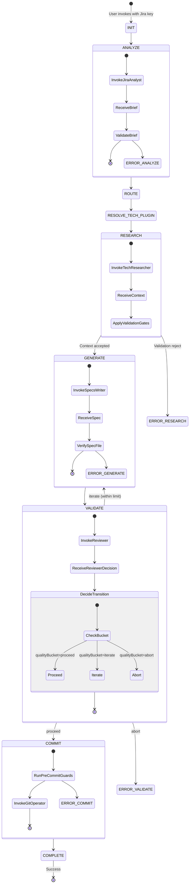

# Specs Workflow State Machine

This skill visualizes workflow control flow only.
Canonical rule sources:

- Routing and artifact naming: `.github/skills/specs-workflow-routing/SKILL.md`
- Technology plugin and reviewer routing: `.github/skills/specs-technology-routing/SKILL.md`
- Validation/scoring policy: `.github/skills/specs-validation/SKILL.md`
- Error taxonomy and templates: `.github/skills/specs-error-handling/SKILL.md`
- Step orchestration and guards: `.github/agents/specs-workflow-orchestrator.agent.md`

## Full Control-Flow View

## Notes

- Numeric scoring thresholds are intentionally not defined in this skill.
- Agent IO contracts are intentionally not defined in this skill.
- If control flow conflicts with canonical sources, canonical sources win.
