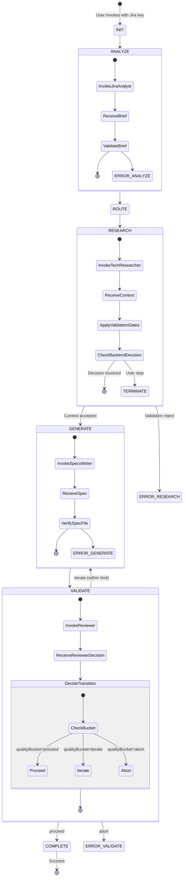

# Specs Workflow State Machine

This skill visualizes workflow control flow only.
Canonical rule sources:

- Routing and artifact naming: `.github/skills/specs-workflow-routing/SKILL.md`
- Validation/scoring policy: `.github/skills/specs-validation/SKILL.md`
- Error taxonomy and templates: `.github/skills/specs-error-handling/SKILL.md`
- Step orchestration and guards: `.github/agents/specs-workflow-orchestrator.agent.md`

## Full Control-Flow View


```mermaid
stateDiagram-v2
    [*] --> INIT: User invokes with Jira key
    INIT --> ANALYZE

    state ANALYZE {
        [*] --> InvokeJiraAnalyst
        InvokeJiraAnalyst --> ReceiveBrief
        ReceiveBrief --> ValidateBrief
        ValidateBrief --> [*]
        ValidateBrief --> ERROR_ANALYZE
    }

    ANALYZE --> ROUTE
    ROUTE --> RESEARCH

    state RESEARCH {
        [*] --> InvokeTechResearcher
        InvokeTechResearcher --> ReceiveContext
        ReceiveContext --> ApplyValidationGates
        ApplyValidationGates --> CheckBackendDecision
        CheckBackendDecision --> [*]: Decision resolved
        CheckBackendDecision --> TERMINATE: User stop
    }

    RESEARCH --> GENERATE: Context accepted
    RESEARCH --> ERROR_RESEARCH: Validation reject

    state GENERATE {
        [*] --> InvokeSpecsWriter
        InvokeSpecsWriter --> ReceiveSpec
        ReceiveSpec --> VerifySpecFile
        VerifySpecFile --> [*]
        VerifySpecFile --> ERROR_GENERATE
    }

    GENERATE --> VALIDATE

    state VALIDATE {
        [*] --> InvokeReviewer
        InvokeReviewer --> ReceiveReviewerDecision
        ReceiveReviewerDecision --> DecideTransition

        state DecideTransition {
            [*] --> CheckBucket
            CheckBucket --> Proceed: qualityBucket=proceed
            CheckBucket --> Iterate: qualityBucket=iterate
            CheckBucket --> Abort: qualityBucket=abort
        }

        DecideTransition --> [*]
    }

    VALIDATE --> COMPLETE: proceed
    VALIDATE --> GENERATE: iterate (within limit)
    VALIDATE --> ERROR_VALIDATE: abort

    COMPLETE --> [*]: Success
```

## Notes

- Numeric scoring thresholds are intentionally not defined in this skill.
- Agent IO contracts are intentionally not defined in this skill.
- If control flow conflicts with canonical sources, canonical sources win.

---

## Canonical workflowId Format

All workflow IDs use the format: `wf-{JIRA_KEY}-{YYYYMMDDTHHmmssZ}`

**Examples**:
- `wf-HON-123-20260619T103400Z` (specs workflow run)
- `wf-HON-123-20260619T141500Z` (implementation workflow run — same key, later timestamp)

The format is **identical** for both specs and implementation runs. The `workflowType` field in the state schema disambiguates them. The timestamp suffix makes multi-run audit entries distinguishable within the same Jira key.

This format is the canonical definition. Both orchestrators (`specs-workflow-orchestrator.agent.md` and `implementation-workflow-orchestrator.agent.md`) MUST generate IDs in this format at Step 0.

---

## State Schema Definition

The complete YAML schema for workflow state objects maintained by the orchestrator during a run. Enforcement rules (required fields per step, blocking conditions) live in `.github/agents/specs-workflow-orchestrator.agent.md`.

### Full State Schema

```yaml
---
# Workflow Metadata
workflowId: wf-{JIRA_KEY}-{YYYYMMDDTHHmmssZ}  # e.g. wf-HON-123-20260619T103400Z
workflowType: specs-generation
currentStep: analyze | route | research | generate | validate | complete
previousStep: {completed-step-name | null}
startedAt: {ISO-8601-timestamp}
updatedAt: {ISO-8601-timestamp}

# Ticket Context
ticket:
  key: {JIRA_KEY}
  issueType: Epic | Story | Task | Spike | Bug | Regression Bug
  summary: {ticket-summary}
  priority: {priority-level}

# Routing Decisions
routing:
  isEpic: true | false
  isSpike: true | false
  techResearcherAgent: Tech Researcher (Story) | Tech Researcher (Epic) | Tech Researcher (Spike)
  specsWriterAgent: Specs Writer (Story) | Specs Writer (Epic) | Specs Writer (Spike)
  specFilename: SPEC-{KEY}.md | SPEC-{KEY}-Epic.md | SPEC-{KEY}-Spike.md

# Artifacts (populated as workflow progresses)
artifacts:
  requirementBrief: present | pending | failed
  technicalContext: present | pending | failed
  specFile: present | pending | failed

# Validation State
validation:
  # Backend Validation (from RESEARCH step)
  backendServicesRequired: true | false | pending
  backendValidationPassed: true | false | pending
  backendValidationOverride: true | false | pending
  backendValidationDecision: continue | stop | pending
  backendValidationNotes: {string | null}

  # Tiered Quality Gates (from RESEARCH step)
  qualityGates: PASSED | PASSED_WITH_WARNINGS | REJECTED | null
  criticalGatesPassed: {0-4 | null}  # Count of critical gates that passed
  importantGatesPassed: {0-7 | null}  # Count of important gates that passed
  optionalGatesPassed: {0-4 | null}  # Count of optional gates that passed
  failedCriticalGates: [list-of-gate-names | null]  # Which critical gates failed
  failedImportantGates: [list-of-gate-names | null]  # Which important gates failed
  warnings: [list-of-quality-warnings | null]  # Quality warnings if PASSED_WITH_WARNINGS

  # Spec Quality (from VALIDATE step)
  qualityScore: {0-100 | null}  # Overall spec quality
  qualityBucket: proceed | iterate | abort | null  # Reviewer decision
  iterationCount: {0-2 | null}  # Number of iterate cycles used (max 2)
  gatesPassed: [list-of-passed-gates | null]  # Passed spec validation gates
  gatesFailed: [list-of-failed-gates | null]  # Failed spec validation gates

# Error State
errors:
  hasErrors: true | false
  errorType: null | hard-stop | recoverable | validation-failure
  errorMessage: {message | null}
  remediationSteps: [list-of-steps | null]

# Session Resumption
resumable: true | false
interruptedAt: {ISO-8601 | null}
completedSteps: [list-of-completed-step-names]
researchCheckpoints: [contextWritten | researchValidationComplete | backendGateResolved | ambiguityGateResolved | reviewContextGateResolved]
contextVersion: {ISO-8601-timestamp-of-CONTEXT-file | null}
pauseReason: orientation-confirmation | backend-validation-approval | ambiguity-gate | review-context-approval | null
pendingDecision: {object | null}
options:
  reviewContext: true | false
---
```

---

## Resumable vs Terminal States

**Resumable** (offer resume on next invocation): `analyze`, `route`, `research`, `generate`, `validate`, `paused`

**Terminal** (not resumable — display history and offer "Start fresh?" instead): `complete`, `aborted`, `terminated`, `error`

> Note: `terminated` (written when the user stops at the backend validation gate) is treated identically to `aborted`. The dual-name is intentional for now — a future cleanup may rename `terminated` to `aborted` but that renaming is out of scope for this implementation.

---

## Resume Decision Table

| Interrupted at step | Checkpoint reached | Resume action |
|---|---|---|
| ANALYZE / ROUTE | BRIEF present | Skip Jira Analyst; re-display G orientation (Mermaid pipeline diagram + "Correct?" prompt); re-use `pendingDecision.complexity` from stored state — do **not** re-run Stage 1 classification; after confirmation proceed to ROUTE |
| RESEARCH | none / `contextWritten` incomplete | Re-run RESEARCH from start |
| RESEARCH | `contextWritten` complete, further checkpoints incomplete | Resume from first incomplete checkpoint |
| RESEARCH | all checkpoints complete | Proceed directly to GENERATE |
| GENERATE | SPEC draft present | Offer: skip to REVIEW, or re-run GENERATE |
| GENERATE | SPEC draft absent | Re-run GENERATE |
| VALIDATE | SPEC present | Re-run spec reviewer only |
| VALIDATE | SPEC absent | Re-run GENERATE then VALIDATE |

---

## Checkpoint Invalidation Rule

RESEARCH checkpoints are bound to `contextVersion` (the last-modified timestamp of `CONTEXT-{KEY}.md`). A resume is trusted only if the stored `contextVersion` matches the current file's last-modified timestamp. If they differ (stale version), treat as `researchCheckpoints: []` and re-run from the first incomplete checkpoint.

RESEARCH checkpoints in order: `contextWritten` → `researchValidationComplete` → `backendGateResolved` → `ambiguityGateResolved` → `reviewContextGateResolved` (last only if `options.reviewContext: true`)

---

## State File Locations

- Specs workflow: `docs/specs/{KEY}/specs-workflow-state.yml` — written by the specs orchestrator
- Implementation workflow: `docs/specs/{KEY}/implementation-workflow-state.yml` — written by the implementation orchestrator

Each file is written at every stage transition. On successful completion, state files are archived to `docs/specs/{KEY}/archive/` with a timestamp suffix. BRIEF, CONTEXT, SPEC, and `audit.log` remain in their original locations — moving them would break downstream prompts.

When offering "Start fresh?" after an aborted or error state: keep `BRIEF-{KEY}.md` in place (still valid input) and delete any stale CONTEXT or SPEC draft files from the interrupted run.

---

## pauseReason Values

| Value | Meaning | pendingDecision shape |
|---|---|---|
| `orientation-confirmation` | G gate awaiting Y/N | `{ issueType, route, complexity }` |
| `backend-validation-approval` | Backend validation failure awaiting continue/stop | `{ validationFailureSummary: string, affectedServices: string[], notes: string }` |
| `ambiguity-gate` | C gate awaiting user resolution | `{ assumptions: Assumption[] }` |
| `review-context-approval` | E gate awaiting feedback | `{ summary: string[], lastContextPath: string }` |
| `null` | No pause in progress | `null` |

