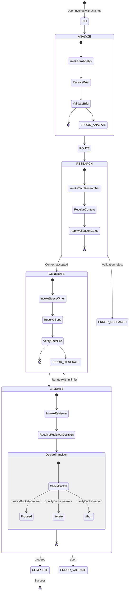

# Specs Workflow State Machine

This skill visualizes workflow control flow only.
Canonical rule sources:

- Routing and artifact naming: `skills/specs-workflow-routing/SKILL.md`
- Validation/scoring policy: `skills/specs-validation/SKILL.md`
- Error taxonomy and templates: `skills/specs-error-handling/SKILL.md`
- Step orchestration and guards: `agents/specs-workflow-orchestrator.agent.md`

## Full Control-Flow View



## Notes

- Numeric scoring thresholds are intentionally not defined in this skill.
- Agent IO contracts are intentionally not defined in this skill.
- If control flow conflicts with canonical sources, canonical sources win.

---

## Canonical workflowId Format

All workflow IDs use the format: `wf-{JIRA_KEY}-{YYYYMMDDTHHmmssZ}`

**Examples**:
- `wf-HON-123-20260619T103400Z` (specs workflow run)
- `wf-HON-123-20260619T141500Z` (implementation workflow run — same key, later timestamp)

The format is **identical** for both specs and implementation runs. The `workflowType` field in the state schema disambiguates them. The timestamp suffix makes multi-run audit entries distinguishable within the same Jira key.

This format is the canonical definition. Both orchestrators (`specs-workflow-orchestrator.agent.md` and `implementation-workflow-orchestrator.agent.md`) MUST generate IDs in this format at Step 0.

---

## State Schema Definition

The complete YAML schema for workflow state objects maintained by the orchestrator during a run. Enforcement rules (required fields per step, blocking conditions) live in `agents/specs-workflow-orchestrator.agent.md`.

### Full State Schema

```yaml
---
# Workflow Metadata
workflowId: wf-{JIRA_KEY}-{YYYYMMDDTHHmmssZ}  # e.g. wf-HON-123-20260619T103400Z
workflowType: specs-generation
currentStep: analyze | route | research | generate | validate | complete
previousStep: {completed-step-name | null}
startedAt: {ISO-8601-timestamp}
updatedAt: {ISO-8601-timestamp}

# Ticket Context
ticket:
  key: {JIRA_KEY}
  issueType: Epic | Story | Task | Spike | Bug | Regression Bug
  summary: {ticket-summary}
  priority: {priority-level}

# Routing Decisions
routing:
  complexityLevel: minimal | standard | comprehensive | null   # Stage 1 result from the orientation gate, reused by the Tech Researcher
  isEpic: true | false
  isSpike: true | false
  techResearcherAgent: Tech Researcher (Story) | Tech Researcher (Epic) | Tech Researcher (Spike)
  specsWriterAgent: Specs Writer (Story) | Specs Writer (Epic) | Specs Writer (Spike)
  specFilename: SPEC-{KEY}.md | SPEC-{KEY}-Epic.md | SPEC-{KEY}-Spike.md

# Artifacts (populated as workflow progresses)
artifacts:
  requirementBrief: present | pending | failed
  technicalContext: present | pending | failed
  specFile: present | pending | failed

# Validation State
validation:
  # Tiered Quality Gates (from RESEARCH step)
  qualityGates: PASSED | PASSED_WITH_WARNINGS | REJECTED | null
  criticalGatesPassed: {0-4 | null}  # Count of critical gates that passed
  importantGatesPassed: {0-4 | null}  # Count of important gates that passed
  optionalGatesPassed: {0-6 | null}  # Count of optional gates that passed
  failedCriticalGates: [list-of-gate-names | null]  # Which critical gates failed
  failedImportantGates: [list-of-gate-names | null]  # Which important gates failed
  warnings: [list-of-quality-warnings | null]  # Quality warnings if PASSED_WITH_WARNINGS

  # Spec Quality (from VALIDATE step)
  qualityScore: {0-100 | null}  # Overall spec quality
  qualityBucket: proceed | iterate | abort | null  # Reviewer decision
  iterationCount: {0-cap | null}  # regenerations performed after an `iterate` verdict; cap owned by specs-quality-review. Increment only when returning to GENERATE
  gatesPassed: [list-of-passed-gates | null]  # Passed spec validation gates
  gatesFailed: [list-of-failed-gates | null]  # Failed spec validation gates

# Usage (orchestrator-common § State Write Protocol)
usage:
  subagentRuns: { {agent name}: {count} }
  userPauses: {count}

# Error State
errors:
  hasErrors: true | false
  errorType: null | hard-stop | recoverable | validation-failure
  errorMessage: {message | null}
  remediationSteps: [list-of-steps | null]

# Session Resumption
resumable: true | false
interruptedAt: {ISO-8601 | null}
completedSteps: [list-of-completed-step-names]
researchCheckpoints: [contextWritten | researchValidationComplete | reviewContextGateResolved | ambiguityGateResolved | patternGateResolved]  # order = execution order: E gate (3a) → C gate (3b) → pattern gate (3c)
contextVersion: {ISO-8601-timestamp-of-CONTEXT-file | null}
contextMutation: {source, baseVersion, request} | null
pauseReason: orientation-confirmation | review-context-approval | research-decisions | null   # legacy ambiguity-gate / pattern-selection-gate resume as research-decisions
pendingDecision: {object | null}
options:
  reviewContext: true | false
---
```

---

## Resumable vs Terminal States

**Resumable** (offer resume on next invocation): `analyze`, `route`, `research`, `generate`, `validate`, `paused`

**Terminal** (not resumable — display history and offer "Start fresh?" instead): `complete`, `aborted`, `terminated`, `error`

> Note: `terminated` (written when the user stops the workflow) is treated identically to `aborted`. The dual-name is intentional for now — a future cleanup may rename `terminated` to `aborted` but that renaming is out of scope for this implementation.

---

## Resume Decision Table

| Interrupted at step | Checkpoint reached | Resume action |
|---|---|---|
| ANALYZE / ROUTE | BRIEF present | Skip Jira Analyst; re-display G orientation (one-line route + "Correct?" prompt); re-use `pendingDecision.complexity` from stored state — do **not** re-run Stage 1 classification; after confirmation proceed to ROUTE |
| RESEARCH | none / `contextWritten` incomplete | Re-run RESEARCH from start |
| RESEARCH | `contextWritten` complete, further checkpoints incomplete | Resume from first incomplete checkpoint |
| RESEARCH | all checkpoints complete | Proceed directly to GENERATE |
| GENERATE | SPEC draft present | Offer: skip to REVIEW, or re-run GENERATE |
| GENERATE | SPEC draft absent | Re-run GENERATE |
| VALIDATE | SPEC present | Re-run spec reviewer only |
| VALIDATE | SPEC absent | Re-run GENERATE then VALIDATE |

---

## Checkpoint Invalidation Rule

### Context Mutation Checkpoint

The orchestrator owns version/checkpoint updates after initial research, a full refresh, localized E-gate feedback, pattern/combined Revision Mode, direct assumption resolutions, and validation repairs. Researchers modify CONTEXT and its validation summary only; they never write workflow state.

Before an expected write, persist `contextMutation: { source, baseVersion, request }` with the triggering step, current file timestamp (null if absent), and the exact feedback/resolutions/pattern choice or repair request. Invalidate `researchValidationComplete` and any gate decisions the requested change affects. This marker is written before dispatch or direct editing, not reconstructed from conversation on resume.

After the write, confirm the requested changes are present and validate the updated CONTEXT using the RESEARCH validation steps without restarting research. Run the full required gates after any revision, including direct frontmatter edits; a previous summary cannot validate changed content. Replace the validation summary with the current outcome. Once all CONTEXT writes are finished, persist its actual last-modified ISO-8601 timestamp in `contextVersion` together with the resulting checkpoints and clear `contextMutation` in the same state write, before pausing or transitioning. Record `contextWritten` for an existing completed artifact and `researchValidationComplete` only for a passing validation. Persist a failed outcome before requesting repairs; failed validation never advances to GENERATE or marks the current decision gate resolved. Missing/partial output or unapplied requests keep the mutation unresolved, never a manufactured completion.

Preserve unaffected earlier gate decisions only when their scope/assumption/pattern inputs remain valid. A full research refresh invalidates downstream approvals; a localized E-gate revision completes E only after validation and the refreshed summary. C/pattern resolutions complete their paired checkpoints only after validation. Update `routing.complexityLevel` if revised frontmatter changes it. This is checkpoint finalization, not an extra research call or feedback round.

On resume with `contextMutation` present, preserve the current CONTEXT and compare it with the saved request before treating its timestamp mismatch as external. If the requested write completed, revalidate and finalize it; if incomplete, resume only that mutation. If authorship or completion is uncertain, pause for confirmation rather than infer approval or overwrite the file. The marker does not authorize accepting unrelated edits. A version match without `researchValidationComplete` resumes validation, not research from scratch.

### External Changes

RESEARCH checkpoints are bound to `contextVersion` (the last-modified timestamp of `CONTEXT-{KEY}.md`). With no pending expected mutation, a missing/different stored version invalidates all old research validation and approval checkpoints, even if the file's summary says PASSED. Preserve an existing CONTEXT, establish `contextWritten` only after checking the artifact, then revalidate it and revisit applicable E/C/pattern decisions against the new version. Do not silently overwrite external edits with fresh research. A missing/unusable artifact requires repair or research from the first incomplete checkpoint. Apply this rule before the resume table, including when the saved step is GENERATE or VALIDATE; stale CONTEXT must return through RESEARCH validation before downstream work.

RESEARCH checkpoints in execution order: `contextWritten` → `researchValidationComplete` → `reviewContextGateResolved` (E gate, only if `options.reviewContext: true`) → `ambiguityGateResolved` + `patternGateResolved` (both recorded together when the Step 3b Research Decisions pause resolves, or when there was nothing to decide). After Revision Mode re-writes CONTEXT, `contextVersion` changes and the validation checkpoint (`researchValidationComplete`) must be re-established before GENERATE.

---

## State File Locations

- Specs workflow: `docs/specs/{KEY}/specs-workflow-state.yml` — written by the specs orchestrator
- Implementation workflow: `docs/specs/{KEY}/implementation-workflow-state.yml` — written by the implementation orchestrator

Each file is written at every stage transition. On successful completion, state files are archived to `docs/specs/{KEY}/archive/` with a timestamp suffix. BRIEF, CONTEXT, SPEC, and `audit.log` remain in their original locations — moving them would break downstream prompts.

When offering "Start fresh?" after an aborted or error state: keep `BRIEF-{KEY}.md` in place (still valid input) and delete any stale CONTEXT or SPEC draft files from the interrupted run.

---

## pauseReason Values

| Value | Meaning | pendingDecision shape |
|---|---|---|
| `orientation-confirmation` | G gate awaiting Y/N | `{ issueType, route, complexity }` |
| `review-context-approval` | E gate (3a) awaiting feedback | `{ summary: string[], lastContextPath: string }` |
| `research-decisions` | C + pattern gate (3b) awaiting blocking-assumption resolutions and/or a pattern choice, in one pause | `{ assumptions: Assumption[], patternCandidates: PatternCandidate[] }` (either may be empty) |
| `null` | No pause in progress | `null` |

